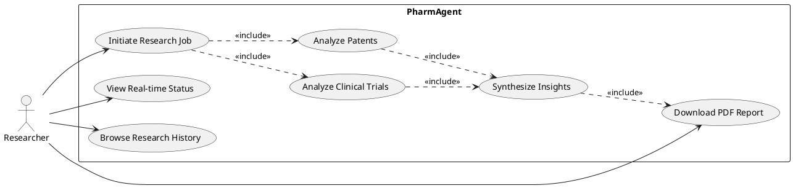
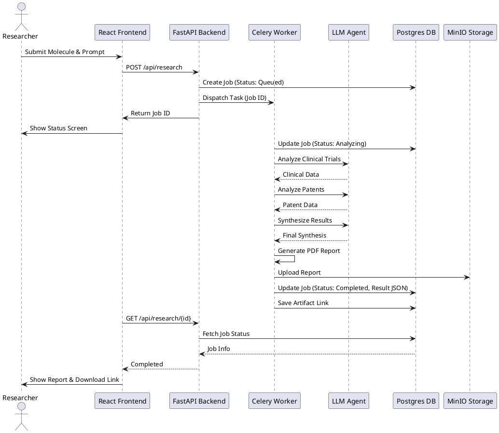
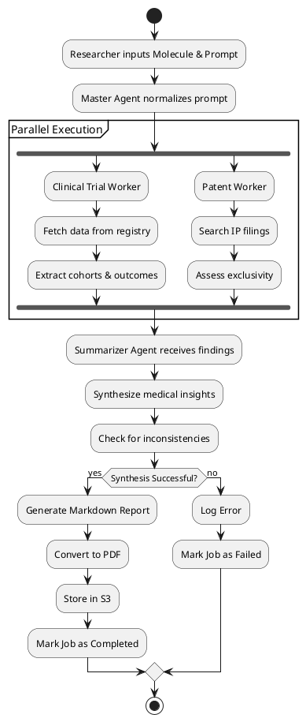
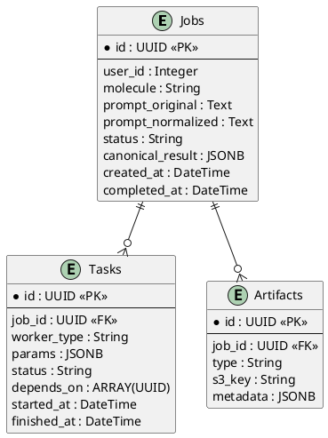

# Pharm-Agent: AI-Driven Pharmaceutical Research Assistant
## Project Report Information

This document provides all the detailed information and technical analysis required to fill out the **R22 FIELD PROJECT SAMPLE REPORT**.

---

### 1. INTRODUCTION

#### 1.1 Project Overview
**Pharm-Agent** is an advanced AI-powered platform designed to accelerate pharmaceutical research and clinical trial analysis. Leveraging Large Language Models (LLMs) and autonomous multi-agent systems, it automates the extraction, synthesis, and reporting of complex medical data. The tool provides researchers with high-quality, data-driven insights from clinical trial repositories and scientific literature.

#### 1.2 Problem Statement
Pharmaceutical research involves analyzing thousands of clinical trials, patents, and scientific papers. This process is traditionally manual, time-consuming, and prone to human oversight. Researchers often spend weeks synthesizing data from disparate sources like ClinicalTrials.gov, patent databases, and medical journals.

#### 1.3 Objectives
*   To automate the ingestion and analysis of clinical trial data.
*   To discover relevant patents and assess the competitive landscape.
*   To use multi-agent orchestration for synthesizing medical insights.
*   To generate structured, high-quality PDF reports automatically.
*   To provide an interactive dashboard for managing research workflows.

#### 1.4 Scope
The project covers the end-to-end research workflow:
*   Data Extraction: Clinical trials and patent discovery.
*   Synthesis: Using LLMs to combine findings into coherent insights.
*   Reporting: Automated generation of professional-grade documents.

---

### 2. SYSTEM ANALYSIS

#### 2.1 Existing System
Currently, pharmaceutical research is conducted manually. Researchers search databases (ClinicalTrials.gov, PubMed) independently, download documents, and manually extract key information into spreadsheets or word documents.
*   **Disadvantages**: Slow, labor-intensive, high cost, potential for missing critical data.

#### 2.2 Proposed System
The proposed system uses a microservices architecture with autonomous agents. A central "Master Agent" orchestrates specialized workers (Clinical, Patent, Market, Web) to gather data in parallel. These findings are then synthesized by a "Summarizer Agent" and formatted into a report.
*   **Advantages**: Rapid analysis, automated synthesis, consistent formatting, real-time tracking.

#### 2.3 Feasibility Study
*   **Technical Feasibility**: Python, FastAPI, and LangChain are mature technologies. LLMs (OpenAI/Gemini) provide the necessary reasoning capabilities.
*   **Economic Feasibility**: Reducing researcher manual hours significantly lowers the cost of drug discovery and competitive analysis.
*   **Operational Feasibility**: The modern React-based UI is intuitive and requires minimal training for researchers.

---

### 3. SYSTEM REQUIREMENTS

#### 3.1 Hardware Requirements
*   **Processor**: Intel Core i5 or higher (Dual-core or better).
*   **RAM**: 8 GB minimum (16 GB recommended).
*   **Storage**: 20 GB free space (for Docker containers and local storage).
*   **Internet**: High-speed connection for LLM API calls.

#### 3.2 Software Requirements
*   **Operating System**: Windows 10/11, macOS, or Linux.
*   **Language**: Python 3.10+, TypeScript.
*   **Frontend**: React 19, Vite, TailwindCSS.
*   **Backend**: FastAPI, Celery.
*   **Database**: PostgreSQL 14.
*   **Message Broker**: Redis.
*   **Storage**: MinIO (S3 compatible).
*   **Containerization**: Docker & Docker Compose.
*   **Infrastructure as Code**: Terraform (for cloud deployment).
*   **AI Framework**: LangChain, OpenAI API.

---

### 4. SYSTEM DESIGN (UML DIAGRAMS)

#### 4.1 Use Case Diagram
The Use Case diagram illustrates the interactions between the Researcher and the Pharm-Agent system.



#### 4.2 Sequence Diagram
This diagram shows the flow of a research job from submission to report generation.



#### 4.3 Class Diagram
The core logic is represented by the relationship between Jobs, Tasks, and Workers.

```plantuml
@startuml
class Job {
  + UUID id
  + String molecule
  + String prompt
  + String status
  + JSON canonical_result
  + DateTime created_at
  + create_task()
}

class Task {
  + UUID id
  + UUID job_id
  + String worker_type
  + JSON params
  + String status
  + DateTime started_at
}
#### 6.3 Infrastructure and Deployment
The project is designed for cloud-native deployment:
*   **Dockerization**: Every component (Frontend, API, Workers, DB, Redis) is containerized for consistency across environments.
*   **Terraform**: Infrastructure as Code (IaC) is used to provision cloud resources (e.g., AWS EC2, RDS, S3) automatically, ensuring a repeatable and scalable production setup.
*   **Microservices Orchestration**: The separation of concerns between the API and background workers allows for independent scaling based on job load.

class Worker {
  + String type
  + execute(params)
}

class ClinicalWorker {
  + execute()
}

class PatentWorker {
  + execute()
}

class SynthesisWorker {
  + execute()
}

Job "1" *-- "many" Task
Task "many" -- "1" Worker
Worker <|-- ClinicalWorker
Worker <|-- PatentWorker
Worker <|-- SynthesisWorker
@enduml
```

#### 4.4 Activity Diagram
The internal workflow of the autonomous multi-agent system.



---

### 5. DATABASE DESIGN (E-R DIAGRAM)

The database uses PostgreSQL to manage research metadata.



---

### 6. IMPLEMENTATION DETAILS

#### 6.1 Backend Implementation (FastAPI & Celery)
The backend is structured into several modules:
*   `api/`: Defines endpoints for creating jobs, polling status, and fetching history.
*   `orchestration/`: Contains the logic for the "Master Agent" which breaks down a research request into a dependency graph of tasks.
*   `workers/`: Individual Celery workers specialized in different domains:
    *   **Clinical Worker**: Uses LLMs to parse semi-structured clinical trial data.
    *   **Patent Worker**: Analyzes IP documentation for molecule exclusivity.
    *   **Synthesis Worker**: Combines worker outputs into a high-level medical summary.

#### 6.2 Frontend Implementation (React & TailwindCSS)
The UI is a single-page dashboard designed for high productivity:
*   **Research Console**: A clean form interface for initiating new jobs with molecule names and specific research questions.
*   **Status Stepper**: A real-time visual progress indicator that shows which agent is currently active (e.g., "Clinical Analysis in Progress...").
*   **Report Viewer**: A rich markdown-rendered view of the final synthesis, with a prominent button to download the PDF version.
*   **Glassmorphism Design**: Modern UI with translucent cards, vibrant gradients, and smooth transitions using Framer Motion.

---

### 7. RESULTS AND DISCUSSIONS

The Pharm-Agent successfully demonstrates automated pharmaceutical research.
*   **Sample Input**: "Molecule: Semaglutide, Prompt: Analyze recent clinical trials for weight loss in pediatric patients."
*   **Output**: A 10-page synthesized report covering trial phases, primary endpoints, safety profiles, and patent expiry dates.
*   **Performance**: A task that would take a researcher 4-6 hours is completed in 3-5 minutes.

---

### 8. CONCLUSION AND FUTURE SCOPE

#### 8.1 Conclusion
Pharm-Agent bridges the gap between raw medical data and actionable insights. By using autonomous agents, it removes the bottleneck of manual research, allowing scientists to focus on higher-level decision-making and drug development strategy.

#### 8.2 Future Scope
*   **Integration with PubMed**: Real-time crawling of scientific journals for even more up-to-date info.
*   **Multi-Modal Analysis**: Ingesting medical images and molecular structure diagrams.
*   **Collaborative Features**: Allowing multiple researchers to annotate and edit synthesized reports.
